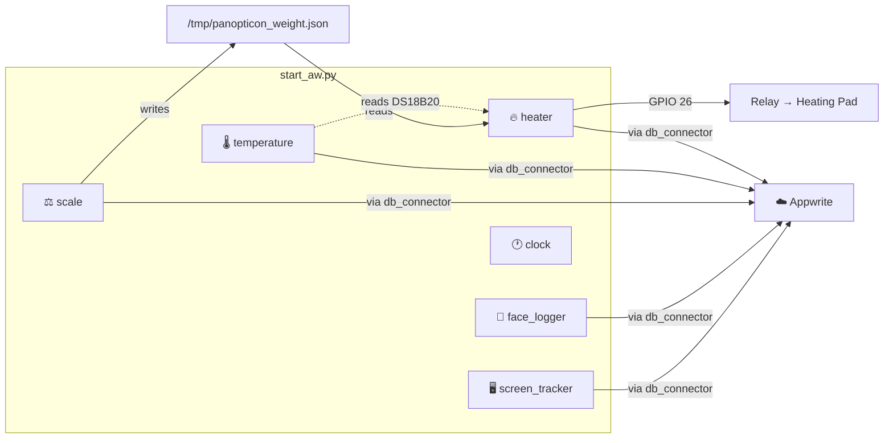
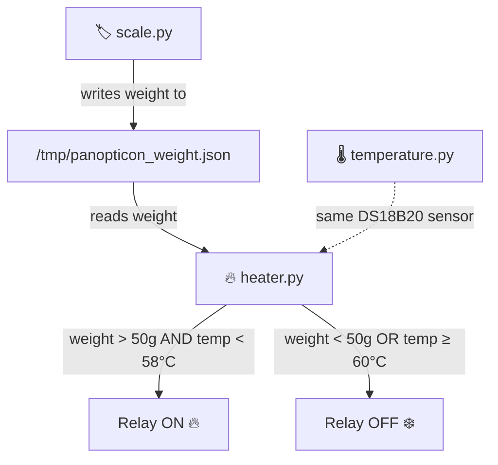

```
....................................................................................................
....................................................................................................
....................................................................................................
...........................................              ...........................................
...................................                              ...................................
...............................                                      ...............................
............................               #@@@@@@@@@@@@#               ............................
.........................               @@@@@@@@@@@@@@@@@@@@               .........................
.......................               @@@@@@@@@@@@@@@@..@@@@@@              ........................
......................              =@@@@@@@@@@@@@@@@.  -@@@@@@-              ......................
.....................              @@@@@@@@@@@@@@@@@@@@@@@@@@@@@%              .....................
....................              =@@@@@@@@@@@@@@@@@@@@@@@@@@@@@@-              ....................
...................               @@@@@@@@@@@@@@@@@@@@@@@@@@@@@@@@               ...................
...................              -@@@@@@@@@@@@@@@@@@@@@@@@@@@@@@@@:              ...................
...................              #@@@@@@@@@@@@@@@@@@@@@@@@@@@@@@@@#              ...................
...................              *@@@@@@@@@@@@@@@@@@@@@@@@@@@@@@@@*              ...................
...................              *@@@@@@@@@@@@@@@@@@@@@@@@@@@@@@@@*              ...................
...................               @@@@@@@@@@@@@@@@@@@@@@@@@@@@@@@@               ...................
....................              @@@@@@@@@@@@@@@@@@@@@@@@@@@@@@@@              ....................
....................               @@@@@@@@@@@@@@@@@@@@@@@@@@@@@@              .....................
......................              @@@@@@@@@@@@@@@@@@@@@@@@@@              ......................
.......................              @@@@@@@@@@@@@@@@@@@@@@@@@@              .......................
.........................              @@@@@@@@@@@@@@@@@@@@@@              .........................
...........................              *@@@@@@@@@@@@@@@@*              ...........................
..............................               -@@@@@@@@-               ..............................
..................................                                ..................................
.........................................                  .........................................
....................................................................................................
....................................................................................................
....................................................................................................

 ____                        _   _                 
|  _ \ __ _ _ __   ___  _ __| |_(_) ___ ___  _ __  
| |_) / _` | '_ \ / _ \| '_ \ __| |/ __/ _ \| '_ \ 
|  __/ (_| | | | | (_) | |_) | |_| | (_| (_) | | | |
|_|   \__,_|_| |_|\___/| .__/ \__|_|\___\___/|_| |_|
                       |_|                          
```

# Panopticon — Raspberry Pi Smart Desk Module

An all-in-one Raspberry Pi system that tracks screen activity, recognises faces, weighs your coffee, and keeps it warm. Built with ActivityWatch, InsightFace, and Appwrite.

> [!IMPORTANT]
> **Zero-Image Architecture** — No facial images are ever stored on disk. Face embeddings live in RAM only, fetched securely from Appwrite on each boot.

---

## What It Does

| Module | Description |
|--------|-------------|
| 🖥️ **Screen Tracker** | Logs active window title & app via ActivityWatch |
| 👤 **Face Recognition** | Identifies who's at the desk using InsightFace (RAM-only) |
| ⚖️ **Scale** | Reads weight from an HX711 load cell |
| 🌡️ **Temperature** | Reads ambient/surface temperature from a DS18B20 sensor |
| 🔥 **Cup Warmer** | Detects a cup on the scale and heats it to 60°C via relay |
| 🕐 **LCD Clock** | Displays time on an attached LCD |
| ☁️ **Cloud Sync** | All data pushed to Appwrite — no local database |

---

## System Architecture



### Cup Warmer Logic



1. **Cup placed on scale** (weight > 50g) → heater enabled
2. **Temp < 58°C** → relay ON, heating pad warms the cup
3. **Temp ≥ 60°C** → relay OFF, target reached (2°C hysteresis prevents cycling)
4. **Cup removed** → relay OFF immediately (safety)

---

## Project Structure

```
panopticon-raspberry/
├── src/
│   ├── start_aw.py             # Main entry point — spawns all modules
│   ├── screen_tracker.py       # ActivityWatch window tracking
│   ├── face_tracker.py         # Face recognition engine (RAM-only)
│   ├── face_logger.py          # Orchestrator & Cloud Sync
│   ├── scale.py                # HX711 load cell reader
│   ├── scale_calibration.py    # Interactive calibration wizard
│   ├── temperature.py          # DS18B20 temperature sensor
│   ├── heater.py               # Relay-controlled cup warmer
│   ├── db_connector.py         # Appwrite Cloud Handler
│   └── clock.py                # LCD clock display
├── activitywatch/              # ActivityWatch (git submodule)
├── setup.sh                    # Full setup script
├── run.sh / run.bat            # Launch scripts
├── requirements.txt
└── .env                        # Configuration (git-ignored)
```

---

## Quick Start

### 1. Clone

```bash
git clone --recurse-submodules https://github.com/ungvl/panopticon-raspberry.git
cd panopticon-raspberry
```

### 2. Setup

```bash
chmod +x setup.sh
./setup.sh
```

This will:
- Install system dependencies
- Initialise ActivityWatch submodules
- Create a Python virtual environment
- Install pip packages (including `RPi.GPIO`)
- Enable 1-Wire for the DS18B20 sensor
- Install the `hx711py` library

> [!NOTE]
> If 1-Wire was just enabled, `setup.sh` will tell you to **reboot** before the temperature sensor works.

### 3. Configure `.env`

```ini
# Appwrite (required for cloud sync)
APPWRITE_ENDPOINT="https://cloud.appwrite.io/v1"
APPWRITE_PROJECT_ID="your_project_id"
APPWRITE_API_KEY="your_api_key"
APPWRITE_DATABASE_ID="your_database_id"
APPWRITE_USERS_COLLECTION_ID="your_users_collection_id"

# Appwrite function endpoints (optional — data logs locally without these)
APPWRITE_FUNCTION_URL=
APPWRITE_FACE_FUNCTION_URL=
APPWRITE_WEIGHT_FUNCTION_URL=
APPWRITE_TEMPERATURE_FUNCTION_URL=
APPWRITE_HEATER_FUNCTION_URL=
```

### 4. Run

```bash
./run.sh            # Linux / Raspberry Pi
run.bat             # Windows
```

Press `Ctrl+C` to stop all modules.

> [!NOTE]
> **First run** downloads ~200MB of AI models. This may take a few minutes.

---

## Hardware Wiring

### HX711 Scale

| HX711 Pin | Pi Pin |
|-----------|--------|
| VCC | 3.3V or 5V |
| GND | GND |
| DT (DOUT) | GPIO 5 |
| SCK | GPIO 6 |

**Calibration** (required before first use):
```bash
sudo python3 -m src.scale_calibration
```

### DS18B20 Temperature Sensor

| DS18B20 Pin | Pi Pin |
|-------------|--------|
| VCC (red) | 3.3V |
| GND (black) | GND |
| DQ (yellow) | GPIO 4 |

> [!IMPORTANT]
> A **4.7kΩ pull-up resistor** is required between DQ and VCC.

Verify detection:
```bash
ls /sys/bus/w1/devices/28-*
```

### Heater Relay

| Relay Pin | Pi Pin |
|-----------|--------|
| IN1 | GPIO 26 (pin 37) |
| VCC | 5V |
| GND | GND |

**Heating pad**: Fyearfly 12V / 12W constant temperature plate (100×120mm), connected via the relay's NO (Normally Open) terminal.

---

## Configuration Reference

All settings are optional and have sensible defaults.

| Variable | Default | Description |
|----------|---------|-------------|
| `HX711_DT_PIN` | `5` | HX711 data pin (BCM) |
| `HX711_SCK_PIN` | `6` | HX711 clock pin (BCM) |
| `HX711_OFFSET` | from file | Scale zero-point offset |
| `HX711_RATIO` | from file | Scale grams-per-unit ratio |
| `SCALE_READ_INTERVAL` | `2.0` | Seconds between scale reads |
| `SCALE_CHANGE_THRESHOLD` | `5.0` | Min grams change to log |
| `SCALE_HEARTBEAT_INTERVAL` | `60.0` | Force log interval (seconds) |
| `TEMP_READ_INTERVAL` | `2.0` | Seconds between temp reads |
| `TEMP_CHANGE_THRESHOLD` | `0.5` | Min °C change to log |
| `TEMP_HEARTBEAT_INTERVAL` | `60.0` | Force log interval (seconds) |
| `HEATER_RELAY_PIN` | `26` | Relay GPIO pin (BCM) |
| `HEATER_TARGET_TEMP` | `60.0` | Target temperature (°C) |
| `HEATER_HYSTERESIS` | `2.0` | Hysteresis band (°C) |
| `HEATER_CUP_THRESHOLD` | `50.0` | Min weight for cup detection (g) |
| `HEATER_CHECK_INTERVAL` | `2.0` | Thermostat check interval (s) |
| `HEATER_RELAY_ACTIVE_LOW` | `true` | Set `false` if relay is active-HIGH |

---

## Data Flow

### Cloud Sync (Startup)
1. System boots → `face_logger` calls `db_connector.sync_known_faces()`
2. Connects to Appwrite, fetches user list + **512-dim face embeddings**
3. Embeddings injected into `FaceTracker` RAM — *no images ever saved to disk*

### Event Logging
| Event | Appwrite Function |
|-------|-------------------|
| Screen activity | `APPWRITE_FUNCTION_URL` |
| Face attendance | `APPWRITE_FACE_FUNCTION_URL` |
| Weight reading | `APPWRITE_WEIGHT_FUNCTION_URL` |
| Temperature reading | `APPWRITE_TEMPERATURE_FUNCTION_URL` |
| Heater state change | `APPWRITE_HEATER_FUNCTION_URL` |

If a function URL is not set, data is logged locally only.

---

## Troubleshooting

| Issue | Fix |
|-------|-----|
| **Camera not detected** | Enable in `raspi-config`. For `libcamera`, install `libcameradev` deps. |
| **Face tracking slow** | Use Pi 4/5. Detection is optimised at `det_size=(160, 160)`. |
| **`ImportError: lib...so.X`** | `sudo apt install libopenblas-dev libopenjp2-7-dev` |
| **Window titles missing** | Switch from Wayland to X11: `raspi-config` → Advanced → Wayland → X11 |
| **DS18B20 not found** | Check 4.7kΩ pull-up resistor. Verify `ls /sys/bus/w1/devices/28-*`. Reboot after `setup.sh`. |
| **Heater not activating** | Ensure scale is calibrated, cup > 50g, and `HEATER_RELAY_ACTIVE_LOW` matches your relay. |
| **Scale reads garbage** | Run `sudo python3 -m src.scale_calibration` to calibrate. |
